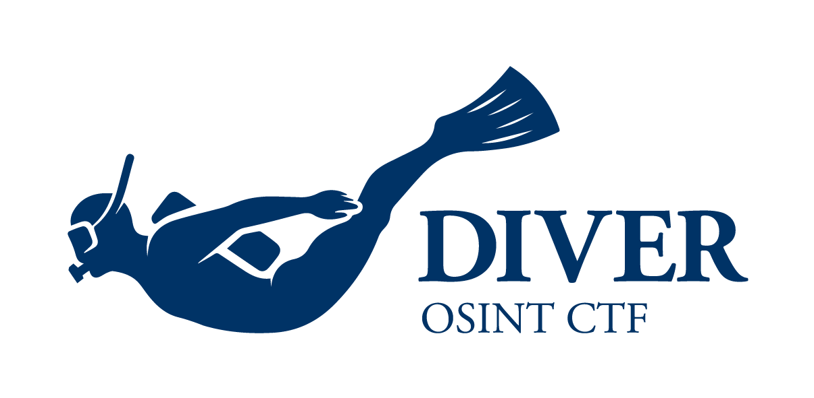

  
  <pre>
    DIVER OSINT CTF is the real-world oriented OSINT CTF.
    We provide country/region-neutral OSINT challenges.
    Challenges will be available in English and Japanese.
  </pre>

## Links

* Twitter / X: [@DIVER_OSINT_CTF](https://x.com/DIVER_OSINT_CTF)
* Discord Server: [DIVER OSINT CTF](https://discord.diverctf.org)
* CTF Time: [DIVER OSINT CTF](https://ctftime.org/ctf/1111)
* Writeups: [diver-osint-ctf/writeups](https://github.com/diver-osint-ctf/writeups)