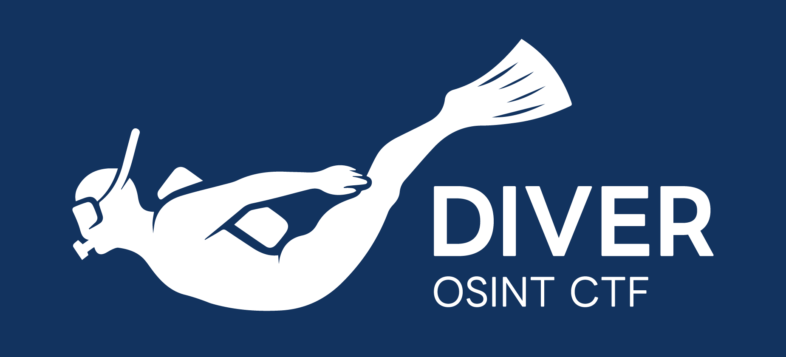

  
  <pre>
    DIVER OSINT CTF is the real-world oriented OSINT CTF.
    We provide country/region-neutral OSINT challenges.
    Challenges will be available in English and Japanese.
  </pre>

  <pre>
    DIVER OSINT CTF は現実世界指向の OSINT CTF（OSINTのコンテスト）です。
    国や地域、レベルを問わず、初心者から上級者まで様々な方々が取り組める問題を出題します。
    出題言語は日本語・英語です。
  </pre>

## Upcoming CTF / 次回開催

### DIVER OSINT CTF 2026

- **2026 Jul 25th (Sat) 03:10 UTC - Jul 26th (Sun) 03:10 UTC** (24hrs)
- Team competition (max 6 people per team)
- online
- [https://ctfd.diverctf.org/](https://ctfd.diverctf.org/)

Stay tuned with following our X account and joining Discord server!

- **2026年7月25日 (土) 12:10 (JST) ～26日（日） 12:10 (JST)** (24時間)
- チーム戦（1チームあたり最大6名）
- オンライン開催

最新情報はXのアカウントをフォロー・Discordサーバに参加することで受け取ることができます。

## Links
* HomePage: [https://diverctf.org](https://diverctf.org)
* Twitter / X: [@DIVER_OSINT_CTF](https://x.com/DIVER_OSINT_CTF)
* Discord Server: [DIVER OSINT CTF](https://discord.diverctf.org)
* CTF Time: [DIVER OSINT CTF](https://ctftime.org/ctf/1111)
* Writeups（過去の問題と解説）: [diver-osint-ctf/writeups](https://github.com/diver-osint-ctf/writeups)
